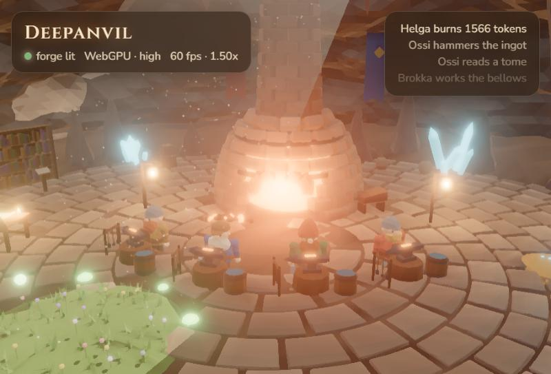
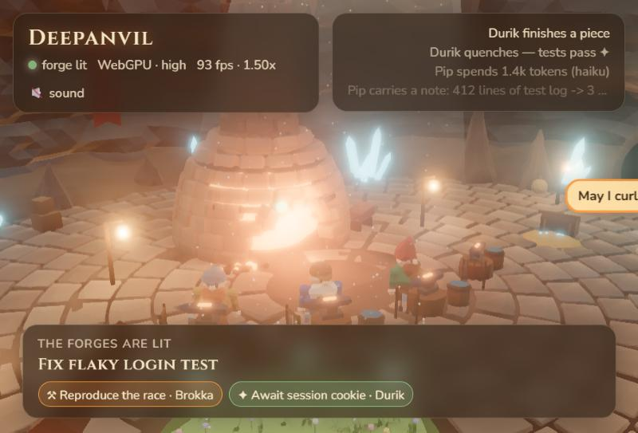
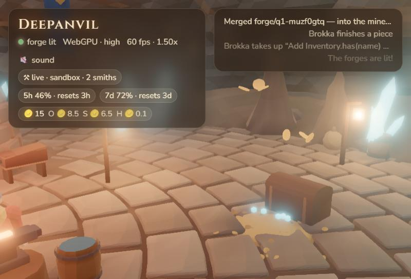
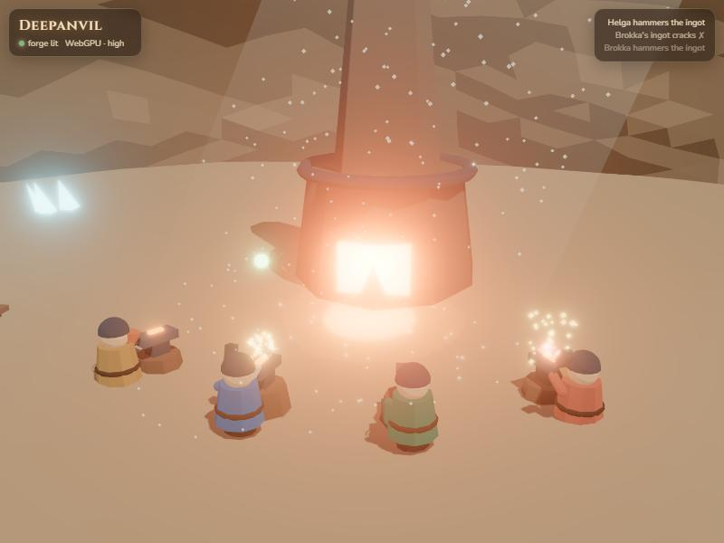
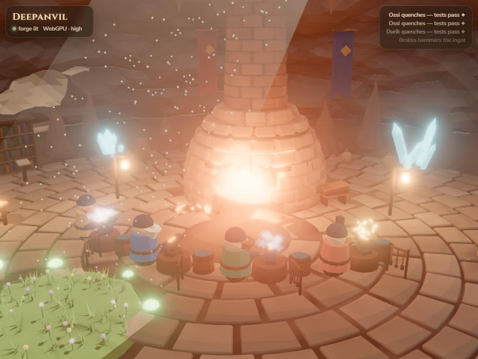
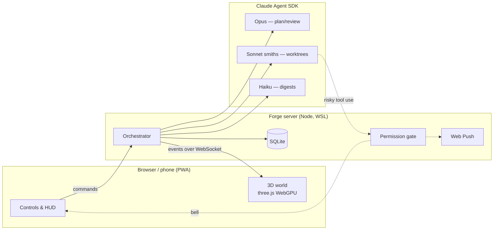

# ⚒ Deepanvil

**A cozy, painterly dwarven forge where your AI coding agents live and work.**

[](https://github.com/elrick97/deepanvil/actions/workflows/ci.yml)


> [!WARNING]
> **Early alpha — a personal project, shared as it grows.** It works end to end on one setup
> (Windows 11 + WSL2 Ubuntu + a Claude subscription) and has mostly been exercised on a practice
> repository. Expect rough edges, breaking changes and setup friction. It runs autonomous agents
> that execute code on your machine: read the [security model](#security-model) first, and start
> with the built-in practice sandbox, not a project you care about.

Deepanvil is a coding-agent harness you can *watch*. Ask the Forgemaster for a feature and a
crew of dwarves gets to work in a sunlit cavern: Opus drafts the blueprint, Sonnet smiths
hammer out the code in their own git worktrees, and a little Haiku sprite carries notes
between them. Every tool call becomes a hammer strike, a trip to the library or a ring of the
bell, and every token spent flies out of the treasury as a gold coin.



It runs on your own machine and is reachable from your phone as an installable web app: the
bell buzzes your pocket when a smith needs your permission.

---

## Highlights

- **A world that is the UI.** A procedural, painterly 3D forge-hall (three.js WebGPU + TSL):
  toon lighting, painted ambient occlusion, rim light and a brushstroke filter on desktop;
  adaptive quality on phones.
- **Token min-maxing.** Each model does only what it's best at:

  | Role | Model | Job |
  |---|---|---|
  | Thráin, the Forgemaster | Opus | Plans blueprints with a context pack per task, re-plans failures, reviews diff *summaries* |
  | The smiths | Sonnet | One scoped task each, in parallel git worktrees |
  | Pip, the sprite | Haiku | Compresses long tool output and diffs, writes banter |
  | Odin, keeper of `main` | Sonnet | Rebases each finished piece on `main`, runs tests/types/lint, reviews the real diff, and only then lets it in |

  The blueprint names the exact files each smith needs, so Sonnet doesn't re-explore the repo;
  Haiku digests noisy logs before a bigger model reads them; and agent sessions are isolated
  from account-level MCP connectors (which otherwise add ~37k tokens to *every* call).
- **The treasury.** Spend is shown in gold coins (1 coin = 1¢ of API-equivalent spend): coins
  fly from the treasury to whoever is spending, the gold pile shrinks as your weekly allowance
  is used, and the furnace burns as hot as the crew is spending. Live 5-hour / 7-day
  subscription usage comes straight from the engine.
- **You stay in charge.** Nothing is built until you approve a blueprint. Risky actions ring
  the bell (in the world and as a push notification) and wait for **Allow / Deny**. A quest can
  be stopped at any moment.
- **Always on, phone-ready.** One process serves the world and the agents; it starts at logon,
  restarts itself, remembers quests and spend (SQLite), and installs to your home screen.

| | |
|---|---|
|  |  |
| A quest in progress: task chips, Pip's digest, a smith off to ring the bell | The treasury: gold coins tumbling to the spender |

<details>
<summary>How it was built — milestone screenshots</summary>

| M0 greybox | M1 procedural hall |
|---|---|
|  |  |

</details>

---

## How it works



The world only reacts to **events** (`packages/shared/src/events.ts`): a simulator and the real
orchestrator speak the same contract, so the world can be developed without spending tokens.

A quest: *request → Thráin asks clarifying questions (a small form, his pick pre-selected) →
Opus blueprint, which you can read task by task, trim or send back for changes → your approval →
Sonnet smiths in parallel worktrees (a smith that finds its task is wrong flags it and Thráin
re-cuts the plan; you can rescope while it runs) →
each finished piece is offered to **Odin**, who rebases it on the latest `main`, runs the gates,
reviews the real diff (Sonnet) and fast-forwards `main` — or sends it back with notes (the second
failure escalates to Opus for a re-plan) → the minecart rolls.* `main` only ever moves to a
tested commit. Design: [docs/ODIN.md](docs/ODIN.md).

## Repository layout

| Path | What |
|---|---|
| `apps/client` | Vite + vanilla three.js (`three/webgpu`, TSL) world, HUD and controls |
| `apps/server` | Forge server: WebSocket + static hosting, orchestrator (`src/agents`), SQLite store, Web Push |
| `packages/shared` | The event contract between world and forge |
| `assets/src` | Procedural Blender (Python) builds of the hall, the skinned crew and the coin |
| `scripts` | Asset pipeline, WSL service, sandbox/engine setup |
| `DESIGN.md` | The design spec and decisions |

## Try the world without agents

No Claude account, WSL or Blender needed — the quest simulator drives the world (Node 24+, any OS):

```bash
npm install
npm run build
MOCK=1 node apps/server/src/index.ts     # then open http://localhost:8787
```

(PowerShell: `$env:MOCK=1; node apps/server/src/index.ts`)

## Getting started (real agents)

**Tested setup:** Windows 11 + WSL2 (Ubuntu), Node 24 on both sides, a Claude subscription
logged in *inside WSL* (`claude` once), git. Optional: Blender 5.2 (to rebuild the 3D assets —
the built ones are committed) and [Tailscale](https://tailscale.com) for phone access.
Native Linux/macOS should mostly work but the helper scripts assume WSL today.

On Windows:

```bash
npm install
npm run build
```

Inside WSL (Ubuntu):

```bash
bash scripts/setup-engine.sh        # the Agent SDK's Linux engine, pinned to the SDK version
bash scripts/setup-sandbox.sh       # a tiny practice repo for the first quests
sudo apt install bubblewrap socat   # the OS sandbox for the smiths (strongly recommended)
```

Back on Windows, check everything and start the always-on forge:

```bash
npm run doctor                      # tells you exactly what's missing and how to fix it
npm run forge:install               # run the forge at Windows logon
npm run forge:start                 # then open http://localhost:8787
```

Ask Thráin for something small ("Add a clear() method to Inventory, with tests"), approve his
blueprint, and watch.

| Command | |
|---|---|
| `npm run doctor` | Check prerequisites; explains every fix |
| `npm run dev` | Client dev server on :5173 (proxies to the forge) |
| `npm run forge:restart` / `forge:log` | Restart the forge after server changes / tail its log |
| `npm run assets` · `assets:crew` · `assets:odin` · `assets:coin` | Rebuild the hall, crew, Odin or coin in headless Blender |
| `npm run typecheck` | TypeScript across all packages |
| `bash scripts/server.sh selftest` (WSL) | Zero-token orchestration + permission self-test (also runs in CI) |
| `MOCK=1` | Run the quest simulator instead of real agents |

Configuration (environment of the forge): `DEEPANVIL_REPO` (repo the crew works on, default
`~/deepanvil/forge/sandbox`), `DEEPANVIL_SMITHS` (parallel smiths, default 2),
`DEEPANVIL_WSL_DISTRO` (default `Ubuntu`), `DEEPANVIL_SANDBOX=0` (disable the OS sandbox),
`DEEPANVIL_PUSH_SUBJECT`, `BLENDER` (path to Blender).

### On your phone

Expose the forge privately on your tailnet (never on the public internet):

```bash
tailscale serve --bg http://localhost:8787
```

Open `https://<your-pc>.<your-tailnet>.ts.net`, then **Share → Add to Home Screen** and tap
**🔔 alerts** to get the bell on your phone.

If the phone times out ("server didn't respond") while `tailscale ping` works, your tailnet
policy doesn't let your devices reach the PC. With a custom policy, add a grant like
`{ "src": ["autogroup:member"], "dst": ["autogroup:self"], "ip": ["tcp:443"] }`.

## Security model

Deepanvil runs autonomous agents that execute code on your machine. Read this before pointing
it at anything you care about.

- **No authentication.** Anyone who can reach port 8787 can drive the forge. It is meant to be
  reached only from `localhost` and your private tailnet. Don't expose it publicly (no Tailscale
  Funnel, no port forwarding), and don't run WSL in *mirrored* networking mode, which would put
  it on your LAN.
- **Same-origin only.** The WebSocket and the notification-answer endpoint reject requests from
  other web origins, so a website open on your computer can't command the forge.
- **Permission gate.** Smiths' tool calls pass an allowlist (`apps/server/src/agents/permissions.ts`):
  reads and edits inside their own worktree, tests, builds and local git run automatically;
  installs, network, anything outside the worktree, shell substitutions and variables ring the
  bell; pushes, `sudo` and sub-agents are refused. The allowlist is covered by the self-test.
- **Residual risk: tests run code.** Auto-approved test/build commands execute project code,
  which a smith can write, so a misbehaving or prompt-injected smith could run arbitrary code
  as your user. Mitigations: the **OS sandbox** (bubblewrap) confines smiths' shell commands to
  their worktree and blocks network; once `bwrap` and `socat` are installed the forge *requires* it
  (writes outside the worktree fail with "Read-only file system"; it warns at startup if missing).
  Also: work on repos you trust, review the blueprint before approving, and let Odin's gates and
  review guard `main`.
- **Agents are isolated** from your account's MCP connectors (mail, calendar, …) and from user
  and project Claude settings.
- **Secrets stay out of the repo.** Push (VAPID) keys, the database and the engine live in
  `~/.deepanvil`; the agents use your existing Claude login. Nothing in this repository is
  machine- or account-specific.

## Known limitations

- **One user, no login** — the forge trusts whoever can reach it (localhost / your tailnet).
- **One repository at a time**, chosen with `DEEPANVIL_REPO`; no project picker yet.
- **Windows + WSL helper scripts**; the server itself is plain Node and should run on Linux/macOS.
- **Mostly exercised on the practice sandbox.** Real projects need working test/typecheck/lint
  commands for Odin's gates (auto-detected from `package.json`, `pyproject.toml` or a `Makefile`);
  without a test command Odin can only review, and says so.
- **Subscription limits are real**: a small quest costs roughly 20 gold coins (≈ $0.20 at API
  list prices); several parallel smiths can hit your 5-hour window.
- The crew's names and looks are placeholders.

## Roadmap

| Version | Focus |
|---|---|
| **v0.1 — early alpha** | The full loop: blueprint → parallel smiths → Odin's gates & review → green `main`; treasury, phone app, push, sandbox |
| **v0.2** — Clear sight | ✓ Odin and the vault in the world; tap-a-dwarf cards, live transcripts, command slates, history |
| **v0.3** — Talk to the forge | ✓ Clarifying questions, blueprint revision, replanning when a task is blocked, rescoping mid-quest · later: repo Q&A, whispering to smiths |
| **v0.4** — Real repos (next) | Project picker, project instructions (CLAUDE.md) and skills, settings, GitHub PR mode, quest board backlog, opt-in MCP |
| **v0.5** — Other realms | OpenAI (Codex) and Gemini agents alongside Claude, assignable per role |
| **v0.6** — The living hall | Crew lore, idle life, day/night, a hall that grows, chronicle & titles, music |
| **v0.7** — Anyone can forge | `npx deepanvil` + setup wizard, native macOS/Linux, device pairing |
| **v1.0** | Public launch: real-repo mileage, security audit, docs site, demo |

The full plan and gap analysis: [docs/ROADMAP.md](docs/ROADMAP.md).

Ideas and bug reports are welcome as issues. The design lives in [DESIGN.md](DESIGN.md) and
[docs/ODIN.md](docs/ODIN.md).

## License

[MIT](LICENSE). Third-party tools (Blender, blender-mcp, the Claude Agent SDK) keep their own licenses and are installed separately, not vendored.
