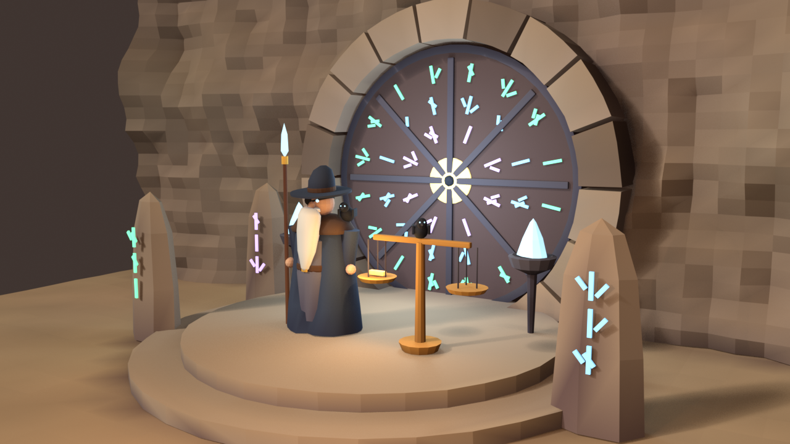
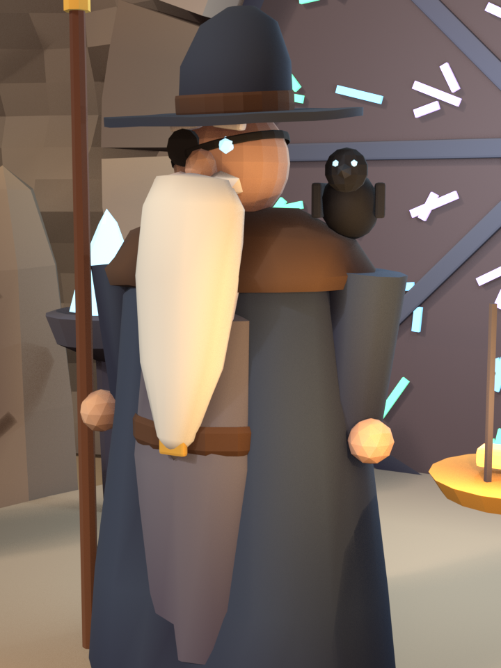

# Odin, Keeper of the Vault of Main — design

> Smiths never touch `main`. They lay their work on Odin's scales; Odin tests it against
> everything already in the vault, reads it, and only then lets it in. `main` stays green by
> construction.



Status: **O1 + O2 built** (2026-10-08): the queue, gates, policy, Sonnet review, send-back loop,
vault health, offering cards with diff viewer and push — covered by the zero-token self-test.
**O3 (Odin and the vault in the world) and O4 (GitHub PRs) are next.** Replaces roadmap P0
items 1–2 and removes Thráin's review step.

---

## 1. Why a separate keeper

| Today | With Odin |
|---|---|
| Thráin (planner) reviews his own blueprint's output | Independent reviewer with one job: guard `main` |
| Review reads Pip's *summary* of the diff | Review reads the **real diff** |
| Branches are merged, never tested together | Each offering is **rebased on the latest `main` and the full gates run** before it lands |
| `main` can go red when two green pieces collide | `main` only ever moves to a **tested commit** (fast-forward) |
| Rejections are vague failures | Rejections go back to the smith with **specific notes** |

## 2. Roles and models

| Role | Model | Does |
|---|---|---|
| Thráin | Opus | Plans and re-plans. **No longer reviews.** |
| Smiths | Sonnet | Do the task; answer Odin's notes; rebase on conflicts |
| **Odin** | **Sonnet, always** (decided) | Reviews the real diff of green offerings |
| Pip | Haiku | Digests failing gate output into fix notes |

Odin is **mostly code, not a model**: rebasing, merging and running gates are deterministic, free
and reliable. Sonnet is only asked for judgement, and only after every gate is green.

**Scoping is enforced, not escalated.** Tasks should be small, so instead of a bigger reviewer for
big diffs, Odin rejects oversized offerings ("split this") — consistent with "always Sonnet".

## 3. The offering (a local PR)

A smith's finished task becomes an **offering**: their branch plus a record. With a GitHub remote
it can optionally also be a real PR (phase 3).

```
smith done ──▶ OFFERED ──▶ QUEUED ──▶ REBASING ──▶ GATES ──▶ REVIEW ──▶ (APPROVE MODE) AWAITING_YOU ──▶ MERGED
                  ▲                       │           │          │                       │
                  └──── SENT_BACK ◀───────┴───────────┴──────────┴───────────────────────┘
                        (conflict)    (gate red)  (changes requested)        (you: send back)
```

States: `queued · rebasing · gates · reviewing · awaiting_you · merged · sent_back · abandoned`.
Each send-back is a new **revision** of the same offering, worked by the same smith in the same
worktree (worktrees now live until their offering is merged or abandoned).

**Revision budget:** an offering gets 2 send-backs; the 3rd failure escalates to Thráin to
re-plan the task (the existing escalation path), and a re-planned task gets one more try.

## 4. Odin's queue, step by step

One offering at a time (FIFO): history stays linear and bisectable, and every merge is tested
against exactly what's already in the vault.

1. **Rebase** the offering onto the latest `main` in Odin's own scratch worktree
   (`<repo>.anvils/odin`). Conflict → `sent_back(conflict)`: the smith rebases and resolves in
   their worktree, then re-offers.
2. **Size check:** diff over `maxDiffLines` (default 400 changed lines, excluding lockfiles)
   → `sent_back(too_big)` with "split this" — or straight to Thráin to split.
3. **Gates** (zero tokens), in the scratch worktree, each with a timeout, inside the OS sandbox
   when available:
   - `tests` — the full suite, not just the task's acceptance check
   - `types` — typecheck (e.g. `tsc --noEmit`, `mypy`)
   - `lint` — linter/formatter check

   A failing gate is re-run once; pass-on-retry is recorded as **flaky** (shown, not blocking).
   Red → `sent_back(gate)`: Pip digests the failing output into concrete fix notes.
   **No model call happens for a red offering.**
4. **Review** (Sonnet, effort `medium`, no tools — the context is in the prompt, so the system
   prompt and schema stay identical across calls and hit the prompt cache):
   input = task brief + acceptance + the real diff + gate summary; output is structured:

   ```json
   { "decision": "approve" | "changes_requested",
     "summary": "one paragraph for the human",
     "findings": [{ "file": "src/x.ts", "line": 42, "severity": "blocker|major|minor|nit", "note": "..." }] }
   ```

   Only `blocker`/`major` findings send work back; `minor`/`nit` ride along as notes.
5. **Verdict:**
   - mode `auto` → `main` is **fast-forwarded** to the tested commit (`git merge --ff-only`)
   - mode `approve` → `awaiting_you`: push notification + offering card; you **Merge** or
     **Send back** (with an optional note)

`main` therefore only ever moves to a commit that passed every gate on top of the current `main`.

### Guarding the vault itself

- On startup, after any merge you do outside the forge, and before the first offering of a quest,
  Odin runs the gates on `main`. Red → **the vault door glows red**, a notification goes out, and
  Odin accepts only offerings that make it green again ("fix main" quests).
- If gates can't run (no test command found), Odin says so plainly — the offering card shows
  "untested: review only" instead of pretending to be green.

## 5. Per-repo policy

Stored in the forge database per repo (not in the repo itself, so a malicious repo can't
loosen its own rules). Auto-detected on first use, editable from the UI.

```jsonc
{
  "mode": "approve",              // "auto" (sandbox) | "approve" (default for real repos)
  "gates": {                      // auto-detected from package.json / pyproject / Makefile
    "tests": "npm test",
    "types": "npx tsc --noEmit",
    "lint": "npx eslint ."
  },
  "gateTimeoutSec": 600,
  "maxDiffLines": 400,
  "flakyRetries": 1,
  "protectedPaths": ["migrations/**", ".github/**"]   // always approve-mode, whatever "mode" says
}
```

## 6. Technical changes

**Event contract** (`packages/shared/src/events.ts`):

```ts
| { type: 'offering.opened';   offeringId; questId; taskId; dwarfId; title; revision; lines }
| { type: 'offering.state';    offeringId; state: OfferingState; reason?: string }
| { type: 'offering.gate';     offeringId; gate: 'tests' | 'types' | 'lint'; status: 'running' | 'pass' | 'fail' | 'flaky' | 'skipped'; summary?: string }
| { type: 'offering.review';   offeringId; decision: 'approve' | 'changes_requested'; summary; findings: Finding[] }
| { type: 'offering.merged';   offeringId; sha }
| { type: 'vault.health';      status: 'green' | 'red' | 'unknown'; sha; failing?: string[] }
```

Commands: `{ type: 'offering.merge'; offeringId }`, `{ type: 'offering.send_back'; offeringId; note? }`,
`{ type: 'offering.diff'; offeringId }` (the diff is fetched on demand, not broadcast).

**Store** (`apps/server/src/store.ts`): `offerings(id, quest_id, task_id, dwarf_id, branch,
base_sha, head_sha, revision, state, reason, lines, created_at, updated_at)`,
`gate_runs(offering_id, revision, gate, status, duration_ms, output_tail)`,
`reviews(offering_id, revision, decision, summary, findings_json)`, `repo_policy(repo, json)`.

**Server modules:**

| Module | Responsibility |
|---|---|
| `agents/odin.ts` | The queue worker: rebase → size → gates → review → verdict |
| `agents/gates.ts` | Detect gate commands; run with timeout + sandbox; tail output; flaky retry |
| `agents/odin-review.ts` | The Sonnet review call (fixed system prompt + schema → cache-friendly) |
| `agents/orchestrator.ts` | Tasks end in an offering instead of a merge; send-backs feed the smith loop; quest completes when all offerings are merged/abandoned; Thráin's review removed |
| `agents/smith.ts` | New attempt mode "address Odin's notes" (findings + digested gate output); "rebase onto main" mode for conflicts |

**Client:**
- Offering cards in the dock: title, smith, revision, gate chips, Odin's summary, findings; a
  **diff viewer** (unified diff, rendered with `textContent`, collapsible per file) fetched on demand.
- **Merge / Send back** buttons (approve mode) — also as notification actions.
- World: the vault, Odin, ravens, and the animations in §7.

**Self-test** additions (zero tokens, stub reviewer): gate red → sent back with notes; flaky
pass; rebase conflict → smith resolves → merged; too-big → split; changes requested → revision 2 →
merged; approve mode waits for you; red `main` blocks unrelated offerings; protected paths force
approve mode; 3rd failure escalates to Thráin.

**Cost:** gates cost nothing; a red offering costs only Pip's digest (~0.1 coin). A green
200-line offering costs one Sonnet review ≈ 2–3 coins. No Opus anywhere in the merge path.

## 7. The world — modeling and animation



**The Vault of Main** — set into the back wall, right of the furnace (a new anchor in
`forge/layout.py`):

| Piece | Model (`assets/src/forge/vault.py`) | Drives |
|---|---|---|
| Rune door | Round stone door (r 2.4 m) in a wedge-block arch, iron rim and 8 spokes; separate node | Swings open on a merge, closes after |
| Rune rings | Three concentric rings of angular glyphs — outer **tests** (green), middle **types** (blue), inner **lint** (violet) — and the **review eye** (gold) at the centre | Each ring lights while its gate runs, blazes on pass, flashes red on fail |
| Rune stones | Three standing stones on the approach, one per gate, with matching glyphs | Mirror the rings, so gates read from any camera angle |
| Dais & scales | Two round steps; a bronze balance where smiths lay their piece | Tips while Odin judges; the offering glows on the pan |
| Braziers | Iron bowls with cold blue rune-fire | Burn brighter while Odin reviews |
| Vault health | All door runes | Steady soft glow = green `main`; red pulse = `main` broken |

**Odin** (`assets/src/forge/odin.py`) — ~2.3 m, taller and slimmer than the crew: deep blue
wanderer's cloak with a shaggy mantle and gold clasp, wide-brimmed slouch hat, eye patch and one
faintly glowing eye, a long white beard to the belt, **Gungnir** (rune-lit spear) in his right hand,
**Huginn** on his shoulder and **Muninn** perched on the scales. For animation he gets the crew's
12-bone skeleton re-proportioned (longer spine and legs), with his own clips:

| Clip | When |
|---|---|
| `idle_watch` | Leaning on Gungnir, ravens shuffling |
| `inspect` | Leans over the scales, hand to beard — while gates run |
| `read` | Holds the offering up to his eye — during the Sonnet review |
| `approve` | Strikes Gungnir's butt on the dais: runes blaze, the door swings open |
| `send_back` | Shakes his head and points back to the anvils |
| `summon` | Raises Gungnir high — `main` went red |

**The ravens carry the notes:** on a send-back, Huginn flies to the smith's anvil with the
findings (speech bubble with the top finding); Muninn flies the approved piece's tale to the
treasury chronicle.

**The smiths' side:** a finished smith walks the offering to the scales and back. A sent-back
smith walks home with the piece; a merged piece rides into the vault through the open door
(the minecart keeps marking a whole quest's completion).

## 8. Build plan

| Phase | Outcome |
|---|---|
| **O1 — The queue** | Offerings, rebase, gates, size check, policy, sent-back loop, self-test. Merge path works with a stub reviewer. |
| **O2 — The review** | Sonnet review with findings; approve mode with offering cards + diff viewer + notification actions; vault health checks. |
| **O3 — The vault** | Vault + Odin + ravens integrated into the hall; rig & clips; gate/rune/door animations; raven note flights. |
| **O4 — GitHub (optional)** | Real PRs when a remote exists: push branch (bell-approved), `gh pr create`, wait for CI checks, Odin's review as a PR comment, merge via `gh`. |

## 9. Open questions

- **Default mode for real repos:** proposed "approve" (Odin recommends, you merge) with "auto"
  for the sandbox — confirm.
- **Diff size limit:** 400 changed lines (lockfiles excluded) as the "split this" threshold?
- **Where reviews run on red `main`:** proposed "fix-main only" (Odin refuses unrelated
  offerings until the vault is green again).
